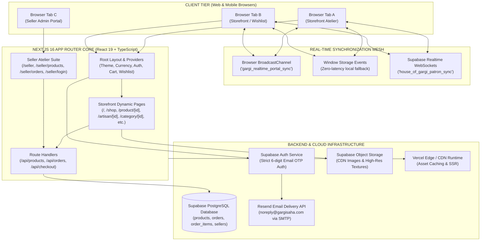
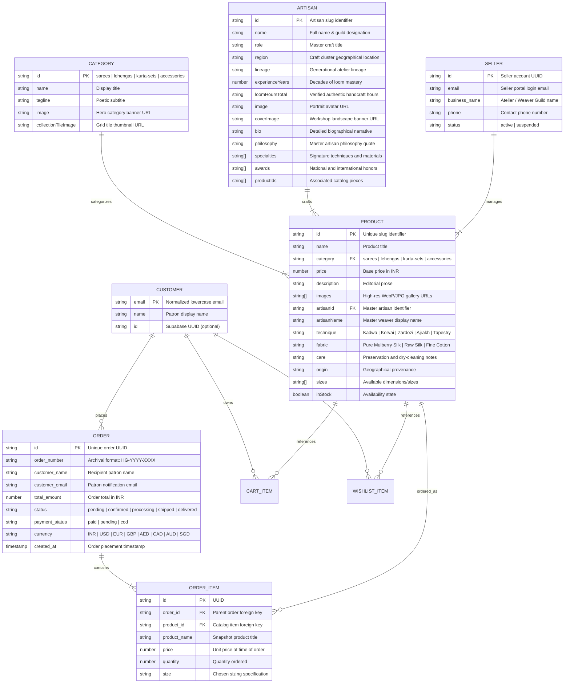
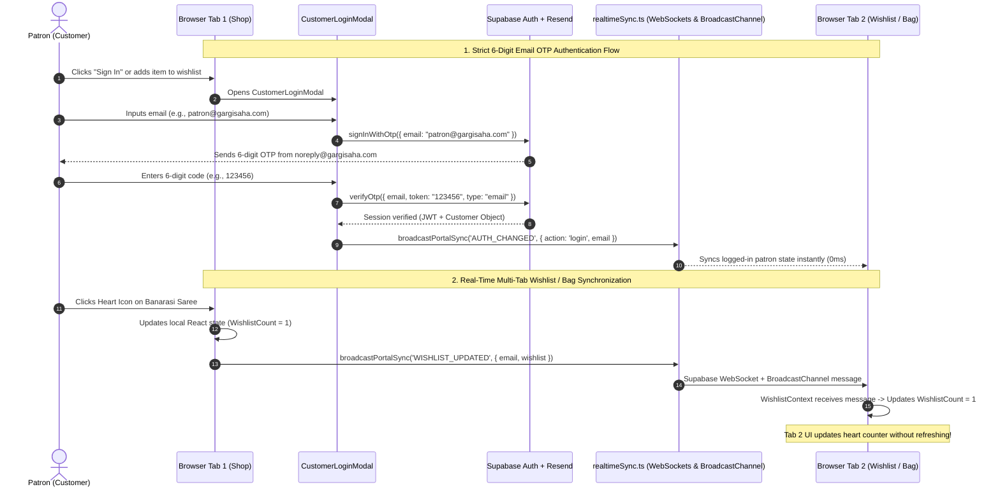
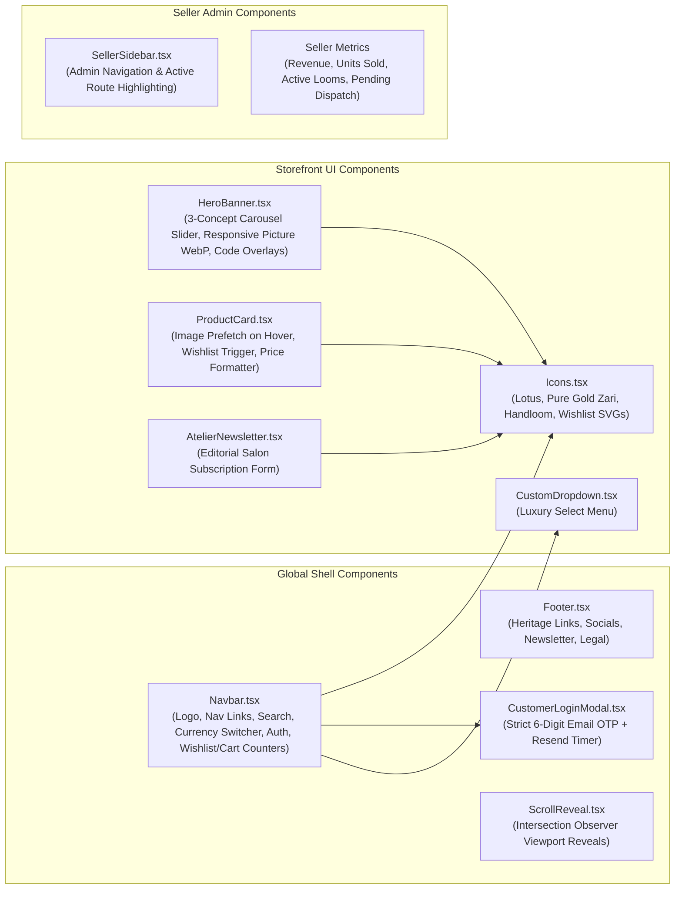

# House of Gargi — Codebase Architecture & System Graph (Graphify)

This document provides a comprehensive structural graph, data relationship model, component dependency tree, and real-time synchronization architecture for **House of Gargi**.

---

## 1. High-Level System Topology Graph

---

## 2. Entity Relationship & Data Model Graph

---

## 3. Application Route & Hierarchy Graph

```mermaid
graph TD
    Root["src/app/layout.tsx (Root Layout & Providers)"]

    %% Storefront Branch
    Root --> StorefrontLayout["src/app/(storefront)/layout.tsx"]
    
    StorefrontLayout --> Home["/ (Home Page with HeroBanner Carousel)"]
    StorefrontLayout --> Shop["/shop (Curated Catalog & Filters)"]
    StorefrontLayout --> CategoryPage["/category/[id] (Category Landing)"]
    StorefrontLayout --> ProductPage["/product/[id] (PDP with Artisan Provenance)"]
    StorefrontLayout --> ArtisanPage["/artisan/[id] (Master Artisan Profile)"]
    StorefrontLayout --> OurArtisans["/our-artisans (Guild Directory)"]
    StorefrontLayout --> CartPage["/cart (Private Shopping Bag & Checkout)"]
    StorefrontLayout --> WishlistPage["/wishlist (Saved Heirloom Registry)"]
    StorefrontLayout --> AccountPage["/account (Patron Atelier Client Suite)"]
    StorefrontLayout --> BespokePage["/bespoke (Private Commission Inquiries)"]
    StorefrontLayout --> OurStory["/our-story (Vedic Philosophy & Origins)"]
    StorefrontLayout --> Sustainability["/sustainability (Ethical Handloom Promise)"]
    StorefrontLayout --> SizeGuide["/size-guide (Measurement Standards)"]
    StorefrontLayout --> ShippingPage["/shipping (White-Glove Logistics)"]
    StorefrontLayout --> ReturnsPage["/returns (Concierge Exchanges & Returns)"]
    StorefrontLayout --> TermsPage["/terms (Terms of Commission)"]
    StorefrontLayout --> PrivacyPage["/privacy (Patron Data Sovereignty)"]
    StorefrontLayout --> FAQPage["/faq (Frequently Asked Questions)"]
    StorefrontLayout --> PressPage["/press (Editorial Features & Press)"]

    %% Seller Branch
    Root --> SellerLayout["src/app/seller/layout.tsx (Seller Portal Auth Guard)"]
    SellerLayout --> SellerDashboard["/seller (Analytics & Revenue Dashboard)"]
    SellerLayout --> SellerLogin["/seller/login (Seller Portal Login)"]
    SellerLayout --> SellerProducts["/seller/products (Catalog Management & Add Item)"]
    SellerLayout --> SellerOrders["/seller/orders (Fulfillment & Dispatch Ledger)"]

    %% API Branch
    Root --> API["src/app/api/"]
    API --> APICheckout["/api/checkout (Order Payload Preparation)"]
    API --> APIOrders["/api/orders (Order Creation & Supabase Sync)"]
    API --> APIProducts["/api/products (Product Catalog CRUD)"]

    %% SEO & System
    Root --> Sitemap["/sitemap.xml (Dynamic XML Sitemap Generator)"]
    Root --> Robots["/robots.txt (Web Crawler Directives)"]
    Root --> NotFound["/_not-found (Luxury 404 Experience)"]
```

---

## 4. State Management & Real-Time Sync Flow

---

## 5. UI Component Hierarchy Graph

---

## 6. Comprehensive Module & File Sitemap

### Core Configuration & Scripts
| File Path | Role & Purpose | Key Exports & Dependencies |
| :--- | :--- | :--- |
| [`package.json`](file:///c:/Users/shaws/ANGA9/HouseOfGargi/package.json) | Project manifests, scripts, dependencies | Next 16.3.4, React 19, Supabase, Resend, Lucide, Sharp |
| [`next.config.js`](file:///c:/Users/shaws/ANGA9/HouseOfGargi/next.config.js) | Next.js compilation, image optimization & cache headers | WebP/AVIF formats, 1-year immutable caching, Supabase remote patterns |
| [`tsconfig.json`](file:///c:/Users/shaws/ANGA9/HouseOfGargi/tsconfig.json) | TypeScript compiler options and `@/*` path aliases | ESNext, Strict mode, JSX preserve |
| [`vercel.json`](file:///c:/Users/shaws/ANGA9/HouseOfGargi/vercel.json) | Vercel deployment build specifications | Serverless runtime routing |
| [`.env.local`](file:///c:/Users/shaws/ANGA9/HouseOfGargi/.env.local) | Environment variables (ignored by Git) | `NEXT_PUBLIC_SUPABASE_URL`, `ANON_KEY`, `RESEND_API_KEY` |
| [`scripts/process-banners.cjs`](file:///c:/Users/shaws/ANGA9/HouseOfGargi/scripts/process-banners.cjs) | Sharp image optimization utility for hero banners | Generates Desktop 2:1 and Mobile 9:16 WebP/JPGs |
| [`scripts/sync-images.cjs`](file:///c:/Users/shaws/ANGA9/HouseOfGargi/scripts/sync-images.cjs) | Product photography automation & Supabase sync | Automated product image ingestion |

---

### Data Models & Utilities
| File Path | Role & Purpose | Key Exports |
| :--- | :--- | :--- |
| [`src/types/index.ts`](file:///c:/Users/shaws/ANGA9/HouseOfGargi/src/types/index.ts) | Core TypeScript interfaces and domain models | `Product`, `Category`, `Artisan`, `CartItem`, `Order`, `Currency` |
| [`src/data/products.ts`](file:///c:/Users/shaws/ANGA9/HouseOfGargi/src/data/products.ts) | 18 catalog products mapped with artisan IDs & provenance | `products`, `categories`, `getProduct`, `getProductsByCategory` |
| [`src/data/artisans.ts`](file:///c:/Users/shaws/ANGA9/HouseOfGargi/src/data/artisans.ts) | 10 generational master weaver guild records | `artisans`, `getArtisan`, `getArtisanByProductId`, `getAllArtisans` |
| [`src/lib/supabaseClient.ts`](file:///c:/Users/shaws/ANGA9/HouseOfGargi/src/lib/supabaseClient.ts) | Supabase client instance with public anon keys | `supabase` |
| [`src/lib/realtimeSync.ts`](file:///c:/Users/shaws/ANGA9/HouseOfGargi/src/lib/realtimeSync.ts) | Real-time WebSocket + BroadcastChannel cross-tab mesh | `broadcastPortalSync`, `subscribeToPortalSync` |
| [`src/lib/resend.ts`](file:///c:/Users/shaws/ANGA9/HouseOfGargi/src/lib/resend.ts) | Resend transactional email client for `noreply@gargisaha.com` | `resend`, `NOREPLY_EMAIL`, `CONCIERGE_EMAIL` |

---

### React Contexts & State Providers
| File Path | Role & Purpose | State & Actions |
| :--- | :--- | :--- |
| [`src/context/CustomerAuthContext.tsx`](file:///c:/Users/shaws/ANGA9/HouseOfGargi/src/context/CustomerAuthContext.tsx) | Email OTP authentication state & multi-tab session sync | `customer`, `isLoggedIn`, `login()`, `logout()`, `openLoginModal()` |
| [`src/context/WishlistContext.tsx`](file:///c:/Users/shaws/ANGA9/HouseOfGargi/src/context/WishlistContext.tsx) | Email-keyed wishlist with real-time cross-tab sync | `wishlist`, `isInWishlist()`, `toggleWishlist()`, `wishlistCount` |
| [`src/context/CartContext.tsx`](file:///c:/Users/shaws/ANGA9/HouseOfGargi/src/context/CartContext.tsx) | Email-keyed shopping bag with real-time cross-tab sync | `cart`, `addToCart()`, `removeFromCart()`, `updateQuantity()`, `subtotal` |
| [`src/context/CurrencyContext.tsx`](file:///c:/Users/shaws/ANGA9/HouseOfGargi/src/context/CurrencyContext.tsx) | 8-currency engine (INR, USD, EUR, GBP, AED, CAD, AUD, SGD) | `currency`, `setCurrency()`, `formatPrice()`, `rates` |

---

### Styling Architecture
| File Path | Style Rules & Design Tokens |
| :--- | :--- |
| [`src/index.css`](file:///c:/Users/shaws/ANGA9/HouseOfGargi/src/index.css) | Core design system: `--maharani-maroon`, `--gargi-gold`, `--ivory-silk`, typography, hero carousel animations, and responsive media queries |
| [`src/account.css`](file:///c:/Users/shaws/ANGA9/HouseOfGargi/src/account.css) | Patron Suite (`/account`) responsive layout, stats badges, and policy card grids |
| [`src/seller.css`](file:///c:/Users/shaws/ANGA9/HouseOfGargi/src/seller.css) | Seller Admin dashboard, revenue metric cards, order ledgers, and inventory tables |

---

## 7. Key Architecture Rationale & Guardrails

1. **Strict 6-Digit Email OTP Authentication**:
   - Eliminates passwords and SMS dependencies in favor of cryptographic 6-digit tokens sent from `noreply@gargisaha.com` via Resend SMTP.
2. **Zero-Latency Multi-Tab Sync (WebSockets + BroadcastChannel)**:
   - Eliminates out-of-sync state across browser tabs when a user browses on one tab and adds/removes pieces in another.
3. **Master Artisan Provenance Linking**:
   - Every product is directly linked to an `Artisan` entity (`/artisan/[artisanId]`), reinforcing authentic Indian heritage craftsmanship and geographical indication (GI).
4. **Performance & Image Optimization**:
   - Static assets cached for 1 year with immutable CDN headers. Responsive `<picture>` tags deliver tailored 9:16 vertical images on mobile and 2:1 wide banners on desktop.
